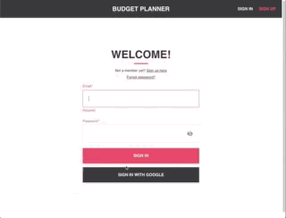

<h1 align="center">
    
</h1>

<h2 align="center">
  Budget Planner
</h2>

<p align="center">A simple budgeting app that tells potential savings based on user data.</p>

<p align="center">
  <a href="https://react-budget-planner.web.app/">Live</a>&nbsp;&nbsp;&nbsp;|&nbsp;&nbsp;&nbsp;
  <a href="https://simongt.net/">Portfolio</a>&nbsp;&nbsp;&nbsp;|&nbsp;&nbsp;&nbsp;
  <a href="https://github.com/simongt">GitHub</a>
</p>

<p align="center">
    
</p>

# Getting Started

### Clone repo locally.

```
git clone git@github.com:simongt/budget-planner.git
```

### Install necessary dependencies for project.

```
npm install
```

### Launch app via local server (with hot reloading).

```
npm start
open http://localhost:8080/
```

### Deploy to local server (dev test environment).

```
npm run build-dev && firebase serve
open http://localhost:5000/
```

### Deploy to production.

```
npm run build-prod && firebase deploy
open https://react-budget-planner.web.app/
```
